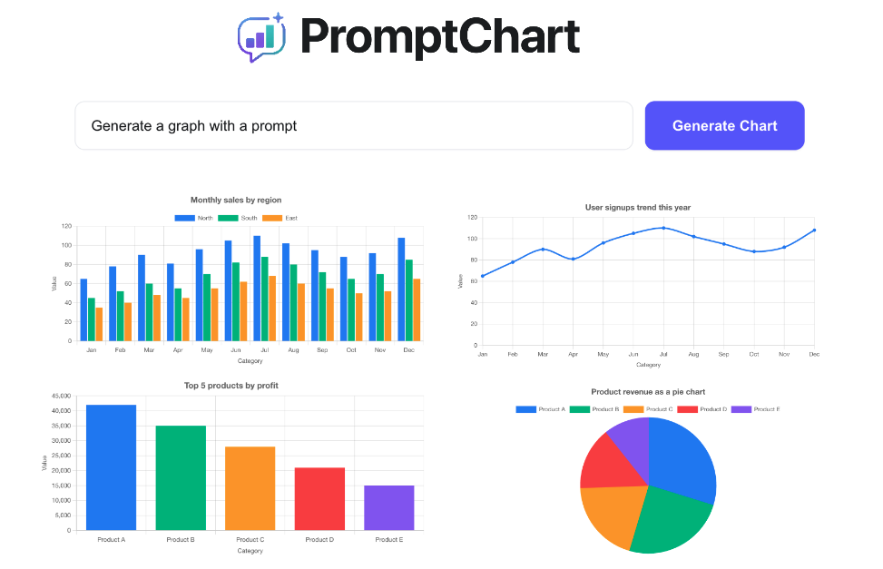

PromptChart is an open-source, framework-agnostic system that converts natural language prompts into safe, on-demand data visualizations.

## How It Works


1. [prompt-chart](https://www.npmjs.com/package/prompt-chart) component sends a natural language prompt (e.g., "Show sales by region")
2. Backend sends the prompt to an LLM to generate structured intent
3. A data adapter executes the query against your data source
4. Chart-ready data is returned and rendered

## :beginner: Getting started

### :desktop_computer: UI

```
npm install prompt-chart
```

If using React, install the following instead:

```
npm install prompt-chart-react
```

Simply add the following to your markup:

```
<prompt-chart></prompt-chart>
```

The exact syntax for the above will vary depending on the framework of your choice. Check out live codepen examples for your [UI framework/library](https://promptchart.live/docs/examples/frameworks) of choice:

| React                                                                                                                                                             | Vue 2                                                                                                                                                                      | Vue 3                                                                                                                                                          | Svelte                                                                                                                                                                 | SvelteKit                                                                                                                                                                                                         | Angular                                                                                                                                                                                | Solid                                                                                                                                                             | Next                                                                                                                                         | Nuxt                                                                                                                                                    | VanillaJS                                                                                                                                                                                                                |
| ----------------------------------------------------------------------------------------------------------------------------------------------------------------- | -------------------------------------------------------------------------------------------------------------------------------------------------------------------------- | -------------------------------------------------------------------------------------------------------------------------------------------------------------- | ---------------------------------------------------------------------------------------------------------------------------------------------------------------------- | ----------------------------------------------------------------------------------------------------------------------------------------------------------------------------------------------------------------- | -------------------------------------------------------------------------------------------------------------------------------------------------------------------------------------- | ----------------------------------------------------------------------------------------------------------------------------------------------------------------- | -------------------------------------------------------------------------------------------------------------------------------------------- | ------------------------------------------------------------------------------------------------------------------------------------------------------- | ------------------------------------------------------------------------------------------------------------------------------------------------------------------------------------------------------------------------ |
| <a href="https://stackblitz.com/edit/deep-chat-react-468spn2s?file=src%2FApp.tsx" target="_blank"></a> | <a href="https://codesandbox.io/p/devbox/deep-chat-vue2-forked-rxcy86?file=%2Fsrc%2FApp.vue" target="_blank"></a> | <a href="https://stackblitz.com/edit/deep-chat-vue3-6etgvs4q?file=src%2FApp.vue" target="_blank"></a> | <a href="https://stackblitz.com/edit/deep-chat-svelte-y3ifpfp4?file=src%2FApp.svelte" target="_blank"></a> | <div align="center"><a href="https://stackblitz.com/edit/deep-chat-sveltekit-cqtewnry?file=src%2Froutes%2F%2Bpage.svelte" target="_blank" ></a></div> | <a href="https://stackblitz.com/edit/stackblitz-starters-csgenhfe?file=src%2Fapp%2Fapp.component.ts" target="_blank"></a> | <a href="https://stackblitz.com/edit/deep-chat-solid-dwzgu9ud?file=src%2FApp.tsx" target="_blank"></a> | <a href="https://promptchart.live/docs/examples/servers#next" target="_blank"></a> | <a href="https://stackblitz.com/edit/nuxt-starter-oxcelpwt?file=app.vue" target="_blank"></a> | <a href="https://codesandbox.io/p/devbox/deep-chat-vanillajs-forked-nrt2f2?file=%2Findex.html&workspaceId=ws_M7pk1beYa89Bp9RcGEAbDe" target="_blank"></a> |

### :gear: Backend

This repository has multiple examples for various backend frameworks. See the [examples](./examples) directory. All of the examples have been configured to automatically work with the [ui](./examples/ui) project:

| Express                                                                                                             | Nest                                                                                                            | Flask                                                                                                             | FastAPI                                                                                                                                         | Spring                                                                                                                    | Go                                                                                                   | SvelteKit                                                                                                                                  | Next                                                                                                       | .NET                                                                                                                                |
| ------------------------------------------------------------------------------------------------------------------- | --------------------------------------------------------------------------------------------------------------- | ----------------------------------------------------------------------------------------------------------------- | ----------------------------------------------------------------------------------------------------------------------------------------------- | ------------------------------------------------------------------------------------------------------------------------- | ---------------------------------------------------------------------------------------------------- | ------------------------------------------------------------------------------------------------------------------------------------------ | ---------------------------------------------------------------------------------------------------------- | ----------------------------------------------------------------------------------------------------------------------------------- |
| <a href="./examples/node/express" target="_blank"></a> | <a href="./examples/node/nestjs" target="_blank"></a> | <a href="./examples/python/flask" target="_blank"></a> | <div align="center"><a href="./examples/python/fastapi" target="_blank"></a></div> | <a href="./examples/java/springboot" target="_blank"></a> | <a href="./examples/go" target="_blank"></a> | <div align="center"><a href="./examples/sveltekit" target="_blank" ></a></div> | <a href="./examples/nextjs" target="_blank"></a> | <div align="center"><a href="./examples/dotnet" target="_blank"></a></div> |

### :robot: Install with AI

Use the [llms.txt](https://github.com/OvidijusParsiunas/PromptChart/blob/main/llms.txt) file as a reference for installing and configuring PromptChart with your code assistant:

```
"Use https://github.com/OvidijusParsiunas/PromptChart/blob/main/llms.txt to add a chat component to my website."
```

### :globe_with_meridians: Documentation

Make sure to checkout the official [website](https://promptchart.live) for more information!

<p align="center">
    
</p>

## :construction_worker: Local setup

```
# Install node dependencies:
$ npm install

# Build the wrapper:
$ npm run build
```

If you wish to edit the component functionality, please see the core [PromptChart](https://www.npmjs.com/package/prompt-chart) package and import your forked package into this component as has been done for `prompt-chart`.

## :heart: Contributions

Open source is built by the community for the community. All contributions to this project are welcome!<br>
Additionally, if you have any suggestions for enhancements, ideas on how to take the project further or have discovered a bug, do not hesitate to create a new issue ticket and we will look into it as soon as possible!
